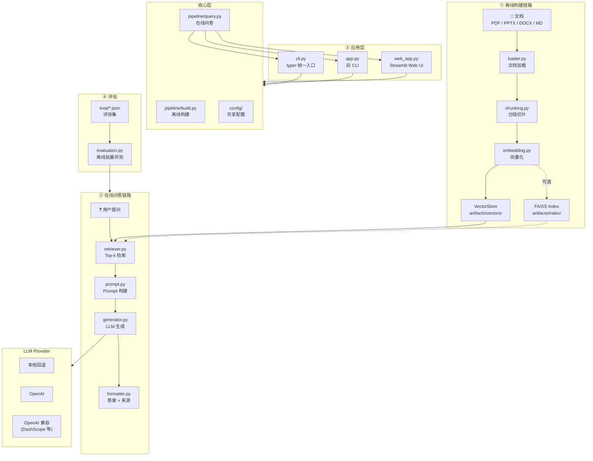

# RAG-Demo

基于课程资料（PDF/PPTX/DOCX/MD）的 RAG 问答 Demo：输入文档 + 问题，输出答案 + 来源。

## 文档与进度

- [TECHNICAL.md](./TECHNICAL.md) — **技术说明文档**（每个环节的详细原理与设计决策）
- [PROGRESS.md](./PROGRESS.md) — 项目进度、任务清单与实现记录（AI 续接用）
- [Outline.md](./Outline.md) — 设计大纲与模块划分
- [tests/README.md](./tests/README.md) — 单元测试说明与覆盖清单

## 架构图



## 项目总结（你现在拿到的能力）

这个项目已经从“离线文档处理”走到“可交互问答应用”，形成了一条可运行、可测试、可扩展的 RAG 闭环：

1. **离线构建链路**：`loader -> chunking -> embedding -> index`，支持缓存与增量复用  
2. **在线问答链路**：`retriever -> prompt -> generator -> formatter`，支持来源追踪  
3. **统一 CLI 入口**：`cli.py`（typer），子命令 `build / query / chat / eval / web`  
4. **多入口兼容**：旧入口 `main.py` / `app.py` / `evaluation.py` / `streamlit run web_app.py` 仍可用  
5. **分层架构**：`config/`（共享配置）→ `pipeline/`（零 IO 核心逻辑）→ UI 入口（CLI / Web），不互相依赖  
6. **多 Provider LLM**：`local/openai/openai_compatible`，支持 `.env` 配置、超时、重试、回退  
7. **质量保障**：核心模块均有单元测试，支持本地快速回归

## 当前进度（Phase 6 — 统一 CLI 重构完成）

- **统一 CLI**（推荐）：

```bash
python cli.py build                           # 离线构建 chunks/vectors/FAISS
python cli.py query "What is A/B testing?"    # 单次问答
python cli.py chat                            # 交互式 REPL
python cli.py eval --eval-set eval/xxx.json   # 批量评估
python cli.py web                             # 启动 Streamlit Web UI
```

- **旧入口**（仍可用）：`python main.py` / `python app.py` / `python evaluation.py` / `streamlit run web_app.py`
- **数据**：文档放在 `data/`（支持 `pdf/pptx/docx/md`），chunk 缓存在 `artifacts/chunks/chunks.json`
- **测试**：`python -m pytest tests/ -v`（当前 71 passed；加 `-s` 可看中英双语输出）

## LLM 配置（支持多 Provider）

- 项目支持 `local` / `openai` / `openai_compatible` 三种 provider（默认可在 `.env` 中设置）
- 推荐在项目根目录使用 `.env`（可参考 `.env.example`）：
  - `OPENAI_API_KEY=...`
  - `LLM_PROVIDER=openai_compatible`
  - `LLM_BASE_URL=https://dashscope.aliyuncs.com/compatible-mode/v1`
  - `LLM_MODEL=qwen-plus`
- 示例（强制真实调用，不回退本地）：
  - `python main.py --query "What is dynamic programming?" --top-k 3 --no-llm-fallback-local`

## 30 秒快速上手

1) 安装依赖并创建 `.env`：

```bash
pip install -r requirements.txt
cp .env.example .env   # 然后编辑 .env 填入你的 API Key
```

2) 离线构建（首次运行）：

```bash
python cli.py build
```

3) 提问：

```bash
python cli.py query "What is A/B testing?" --no-fallback
```

4) 交互模式：

```bash
python cli.py chat
```

5) Web UI：

```bash
python cli.py web
```

结果判定：若成功输出 `Answer` 与 `Sources`，说明已完成真实 API 调用。若报错，按提示修正模型名或权限后重试。

## 编码规范

- 文档和代码统一使用 `UTF-8` 编码保存，避免中文乱码。

## 评估功能（确认系统是否“真的有用”）

项目已内置最小评估脚本 `evaluation.py`，用于批量跑问答并输出结构化指标报告。

- **输入**：评测集 JSON（默认 `eval/eval_set.example.json`）
- **输出**：评估报告 JSON（默认 `artifacts/eval/latest_report.json`）
- **核心指标**：
  - `answer_exact_match_avg`：答案精确匹配均值 — 衡量生成答案与参考答案是否完全一致，是最严格的正确性基线
  - `answer_token_f1_avg`：答案 token F1 均值 — 在词粒度上同时考量准确率和召回率，比 EM 更宽容地反映答案质量
  - `keyword_recall_avg`：关键词覆盖率均值 — 检验答案是否涵盖了领域核心术语，防止"看似通顺但答非所问"
  - `source_recall_avg`：来源召回均值 — 衡量检索链路是否找到了正确的文档段落，直接反映 retriever 质量
  - `source_hit_rate`：来源命中率 — 至少命中一个正确来源的比例，是"检索可用性"的底线指标

运行示例：

```bash
python evaluation.py --eval-set eval/eval_set.example.json --top-k 3 --llm-provider local
```

启用“低相关拒答”阈值（推荐用于 `I don't know` 对照实验）：

```bash
python evaluation.py --eval-set eval/eval_set.20_questions.json --llm-provider local --top-k 3 --min-relevance-score 0.2
```

如果需要真实大模型评估，可改为：

```bash
python evaluation.py --eval-set eval/eval_set.example.json --llm-provider openai_compatible --llm-model qwen-plus --llm-base-url https://dashscope.aliyuncs.com/compatible-mode/v1 --no-llm-fallback-local
```

评测样本字段（可按需裁剪）：

```json
[
  {
    "id": "case_id",
    "query": "问题文本",
    "expected_answer": "参考答案（可选）",
    "expected_keywords": ["关键词1", "关键词2"],
    "expected_sources": [{"source": "xxx.pdf", "page": 3}],
    "top_k": 3
  }
]
```

说明：
- `--min-relevance-score` 用于过滤低相关检索结果；被全部过滤后会触发无上下文路径，模型应更倾向回答 `I don't know`
- 项目已提供 `eval/eval_set.20_questions.json`（30 题混合评测集，其中包含应答 `I don't know` 的对照样本）

## 当前不足（可改进点）

1. **检索质量仍偏基础**：当前以向量相似度 Top-k 为主，缺少重排（rerank）与查询改写。  
2. **会话记忆能力有限**：Web UI 仅维护当前会话历史，缺少“长期记忆/跨会话持久化”。  
3. **评测体系仍需增强**：已有基础离线评估，但尚缺人工标注集扩展、版本间自动对比与可视化看板。  
4. **生产化能力不足**：尚未引入权限体系、限流、审计日志、服务化部署规范。  
5. **多模态能力缺失**：当前聚焦 PDF 文本问答，尚未覆盖表格/图片/多文件融合检索。

## 可扩展方向（建议路线图）

### P0（短期，1-2 周）

- 接入 **Reranker**（如 cross-encoder）提升 Top-k 结果排序质量。  
- 增加 **问答评测脚本**（准确率/引用命中率/拒答率），形成可量化回归。  
- 为 `web_app.py` 增加 **会话持久化**（本地 JSON/SQLite）。

### P1（中期，2-4 周）

- 增加 **Hybrid Retrieval**（BM25 + 向量召回融合）提升长尾问题命中率。  
- 增加 **查询改写与多跳检索**（query rewrite / decomposition）。  
- 增加 **流式输出** 与更细粒度来源展示（段落级高亮）。

### P2（长期）

- 服务化（FastAPI）+ 可观测性（Tracing/Metrics）+ 灰度配置。  
- 用户反馈闭环（thumbs up/down）驱动 prompt/检索持续优化。  
- 扩展到多模态与企业知识库场景（权限分层、增量索引、文档版本管理）。

---

```text
# 常用 git
git add .
git commit -m "写一句你这次改了什么"
git push


git log --oneline 看版本记录
git restore --source abc1234 文件1 文件2
```
