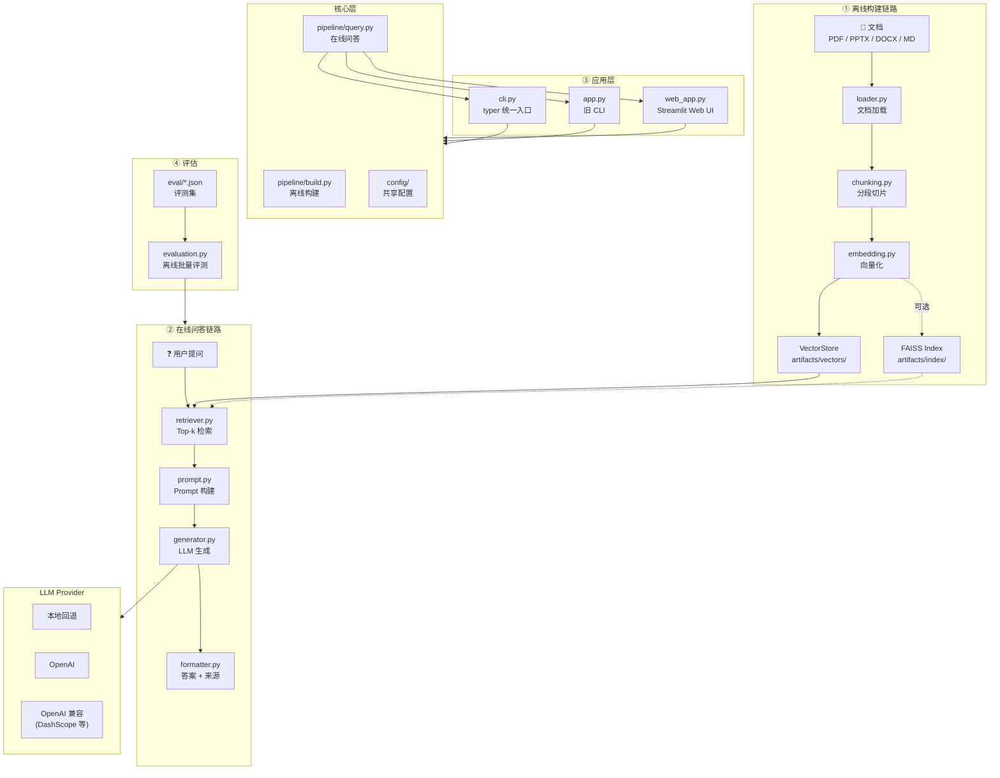

# RAG-Demo

A modular **Retrieval-Augmented Generation (RAG)** system for document-based question answering. The system supports multiple document formats (PDF/PPTX/DOCX/MD), provides a unified CLI interface, and includes an offline evaluation framework for measuring retrieval and generation quality.

基于课程资料的多格式 RAG 问答系统：输入文档 + 问题，输出答案 + 来源。  
*Modular RAG for course materials: documents in → answers and sources out.*


## Tech Stack

- Python · FAISS（向量索引）· Typer（CLI 框架）· Streamlit（Web UI）· OpenAI 及兼容 API

## Table of Contents

- [Key Features](#key-features)
- [Architecture](#架构图)
- [Project Summary](#项目总结你现在拿到的能力)
- [Quick Start](#30-秒快速上手)
- [CLI Usage](#当前进度phase-6--统一-cli-重构完成)
- [Evaluation](#评估功能确认系统是否真的有用)
- [Limitations](#当前不足可改进点)
- [Roadmap](#可扩展方向建议路线图)

## Key Features

- **Modular RAG pipeline** — loader → chunking → embedding → retrieval → generation  
  模块化 RAG 流水线：加载 → 切分 → 向量化 → 检索 → 生成
- **Unified CLI interface** — Typer (`build` / `query` / `chat` / `eval` / `web`)  
  统一 CLI：Typer 驱动，五种子命令
- **Multi-format document support** — PDF, PPTX, DOCX, and Markdown  
  多格式文档支持：PDF / PPTX / DOCX / MD
- **Pluggable LLM providers** — local / OpenAI / OpenAI-compatible APIs (DashScope, etc.)  
  可插拔 LLM：本地 / OpenAI / 兼容 API（如 DashScope）
- **Offline evaluation framework** — multiple metrics and benchmark datasets  
  离线评估框架：多指标、可扩展评测集
- **Layered architecture** — configuration, pipeline logic, and UI separated  
  分层架构：配置、流水线逻辑与 UI 解耦

## 文档与进度 (Docs & Progress)

- [TECHNICAL.md](./TECHNICAL.md) — **技术说明文档** / *Technical specs*（原理与设计决策）
- [PROGRESS.md](./PROGRESS.md) — **项目进度** / *Project progress*（任务清单、AI 续接用）
- [Outline.md](./Outline.md) — **设计大纲** / *Design outline*（模块划分）
- [tests/README.md](./tests/README.md) — **单元测试** / *Unit tests*（说明与覆盖清单）

## 架构图 (Architecture)



The architecture separates the system into four layers: (1) Offline indexing pipeline, (2) Online question answering pipeline, (3) Application interfaces (CLI / Web), (4) Evaluation framework.

架构分四层：① 离线索引流水线 ② 在线问答流水线 ③ 应用接口（CLI / Web）④ 评估框架

## 项目总结（你现在拿到的能力） (Project Summary)

From offline document processing to interactive QA: a runnable, testable, and extensible RAG pipeline.  
从离线文档处理到交互式问答：一个可运行、可测试、可扩展的 RAG 流水线。

1. **离线构建链路** / *Offline build*：`loader -> chunking -> embedding -> index`，支持缓存与增量复用  
2. **在线问答链路** / *Online QA*：`retriever -> prompt -> generator -> formatter`，支持来源追踪  
3. **统一 CLI 入口** / *Unified CLI*：`cli.py`（typer），子命令 `build / query / chat / eval / web`  
4. **多入口兼容** / *Legacy entries*：`main.py` / `app.py` / `evaluation.py` / `streamlit run web_app.py` 仍可用  
5. **分层架构** / *Layered*：`config/` → `pipeline/` → UI，零 IO 核心逻辑、不互相依赖  
6. **多 Provider LLM** / *Pluggable LLM*：`local/openai/openai_compatible`，`.env` 配置、超时、重试、回退  
7. **质量保障** / *Quality*：核心模块单元测试，本地快速回归

## 当前进度（Phase 6 — 统一 CLI 重构完成） (Current Status)

- **统一 CLI** / *Unified CLI*（推荐）：

```bash
python cli.py build                           # Build offline: chunks/vectors/FAISS | 离线构建
python cli.py query "What is A/B testing?"    # Single Q&A | 单次问答
python cli.py chat                            # Interactive REPL | 交互式 REPL
python cli.py eval --eval-set eval/xxx.json   # Batch eval | 批量评估
python cli.py web                             # Start Streamlit UI | 启动 Web UI
```

- **旧入口** / *Legacy*（仍可用）：`python main.py` / `python app.py` / `python evaluation.py` / `streamlit run web_app.py`
- **数据** / *Data*：文档放在 `data/`（`pdf/pptx/docx/md`），chunk 缓存在 `artifacts/chunks/chunks.json`
- **测试** / *Tests*：`python -m pytest tests/ -v`（71 passed；`-s` 可看中英双语输出）

## LLM 配置（支持多 Provider） (LLM Configuration)

- 项目支持 `local` / `openai` / `openai_compatible` 三种 provider / *Supports 3 providers*（默认可在 `.env` 中设置）
- 推荐在项目根目录使用 `.env` / *Use `.env` in project root*（可参考 `.env.example`）：
  - `OPENAI_API_KEY=...`
  - `LLM_PROVIDER=openai_compatible`
  - `LLM_BASE_URL=https://dashscope.aliyuncs.com/compatible-mode/v1`
  - `LLM_MODEL=qwen-plus`
- 示例 / *Example*（强制真实调用，不回退本地 / *Force real API, no local fallback*）：
  - `python main.py --query "What is dynamic programming?" --top-k 3 --no-llm-fallback-local`

## 30 秒快速上手 (Quick Start)

1) 安装依赖并创建 `.env` / *Install deps and create `.env`*：

```bash
pip install -r requirements.txt
cp .env.example .env   # Edit and add your API Key | 编辑并填入 API Key
```

2) 离线构建（首次运行）/ *Build offline (first run)*：

```bash
python cli.py build
```

3) 提问 / *Ask a question*：

```bash
python cli.py query "What is A/B testing?" --no-fallback
```

4) 交互模式 / *Interactive mode*：

```bash
python cli.py chat
```

5) Web UI：

```bash
python cli.py web
```

结果判定：若成功输出 `Answer` 与 `Sources`，说明已完成真实 API 调用。若报错，按提示修正模型名或权限后重试。  
*Success = `Answer` + `Sources` output. On error, fix model name or API permissions.*

## 编码规范 (Coding Standards)

- Use UTF-8 for all files to avoid encoding issues.  
  所有文件统一使用 UTF-8 编码，避免编码问题。

## 评估功能（确认系统是否“真的有用”） (Evaluation)

项目已内置最小评估脚本 `evaluation.py`，用于批量跑问答并输出结构化指标报告。  
*Built-in `evaluation.py` runs batch Q&A and outputs structured metrics.*

- **输入** / *Input*：评测集 JSON（默认 `eval/eval_set.example.json`）
- **输出** / *Output*：评估报告 JSON（默认 `artifacts/eval/latest_report.json`）
- **核心指标** / *Metrics*：
  - `answer_exact_match_avg`：答案精确匹配均值 / *Exact match* — 衡量生成与参考答案是否完全一致
  - `answer_token_f1_avg`：答案 token F1 均值 / *Token F1* — 词粒度准确率与召回率
  - `keyword_recall_avg`：关键词覆盖率均值 / *Keyword recall* — 检验答案是否涵盖核心术语
  - `source_recall_avg`：来源召回均值 / *Source recall* — 检索是否找到正确文档段落
  - `source_hit_rate`：来源命中率 / *Source hit rate* — 至少命中一个正确来源的比例

运行示例 / *Run example*：

```bash
python evaluation.py --eval-set eval/eval_set.example.json --top-k 3 --llm-provider local
```

启用“低相关拒答”阈值 / *Min-relevance threshold*（推荐用于 `I don't know` 对照实验）：

```bash
python evaluation.py --eval-set eval/eval_set.20_questions.json --llm-provider local --top-k 3 --min-relevance-score 0.2
```

如果需要真实大模型评估 / *For real LLM eval*，可改为：

```bash
python evaluation.py --eval-set eval/eval_set.example.json --llm-provider openai_compatible --llm-model qwen-plus --llm-base-url https://dashscope.aliyuncs.com/compatible-mode/v1 --no-llm-fallback-local
```

评测样本字段 / *Eval sample schema*（可按需裁剪）：

```json
[
  {
    "id": "case_id",
    "query": "问题文本",
    "expected_answer": "参考答案（可选）",
    "expected_keywords": ["关键词1", "关键词2"],
    "expected_sources": [{"source": "xxx.pdf", "page": 3}],
    "top_k": 3
  }
]
```

说明 / *Notes*：
- `--min-relevance-score` 用于过滤低相关检索结果；被全部过滤后会触发无上下文路径，模型应更倾向回答 `I don't know`  
  *Filters low-relevance results; when all filtered, model should tend to answer `I don't know`*
- 项目已提供 `eval/eval_set.20_questions.json`（30 题混合评测集，其中包含应答 `I don't know` 的对照样本）  
  *30-question mixed eval set with `I don't know` samples*

## 当前不足（可改进点） (Limitations)

1. **检索质量仍偏基础** / *Basic retrieval*：当前以向量相似度 Top-k 为主，缺少重排（rerank）与查询改写。  
2. **会话记忆能力有限** / *Limited session memory*：Web UI 仅维护当前会话历史，缺少“长期记忆/跨会话持久化”。  
3. **评测体系仍需增强** / *Eval gaps*：已有基础离线评估，但尚缺人工标注集扩展、版本间自动对比与可视化看板。  
4. **生产化能力不足** / *Not production-ready*：尚未引入权限体系、限流、审计日志、服务化部署规范。  
5. **多模态能力缺失** / *No multimodal*：当前聚焦 PDF 文本问答，尚未覆盖表格/图片/多文件融合检索。

## 可扩展方向（建议路线图） (Roadmap)

### P0（短期，1-2 周） / *Short term*

- 接入 **Reranker**（如 cross-encoder）提升 Top-k 结果排序质量。  
  *Add Reranker (e.g. cross-encoder) to improve Top-k ranking*
- 增加 **问答评测脚本**（准确率/引用命中率/拒答率），形成可量化回归。  
  *QA eval script (accuracy / citation hit / refusal rate) for regression*
- 为 `web_app.py` 增加 **会话持久化**（本地 JSON/SQLite）。  
  *Session persistence for web_app (JSON/SQLite)*

### P1（中期，2-4 周） / *Mid term*

- 增加 **Hybrid Retrieval**（BM25 + 向量召回融合）提升长尾问题命中率。  
  *Hybrid retrieval (BM25 + vector) for long-tail queries*
- 增加 **查询改写与多跳检索**（query rewrite / decomposition）。  
  *Query rewrite and multi-hop retrieval*
- 增加 **流式输出** 与更细粒度来源展示（段落级高亮）。  
  *Streaming output + paragraph-level source highlighting*

### P2（长期） / *Long term*

- 服务化（FastAPI）+ 可观测性（Tracing/Metrics）+ 灰度配置。  
  *FastAPI service + observability + canary config*
- 用户反馈闭环（thumbs up/down）驱动 prompt/检索持续优化。  
  *User feedback loop for prompt / retrieval optimization*
- 扩展到多模态与企业知识库场景（权限分层、增量索引、文档版本管理）。  
  *Multimodal & enterprise KB (auth, incremental index, doc versioning)*

---

```text
# 常用 git / Common git commands
git add .
git commit -m "写一句你这次改了什么"   # Describe your changes
git push

git log --oneline   # 看版本记录 | View commit history
git restore --source abc1234 文件1 文件2   # Restore files from commit
```
